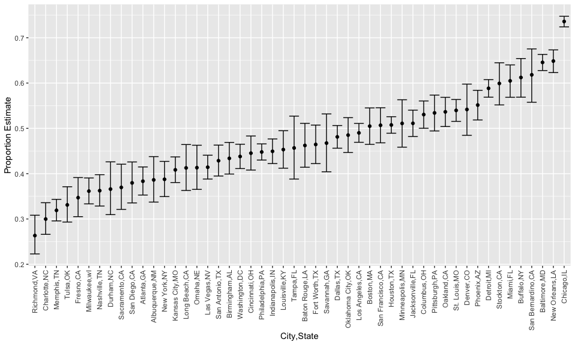
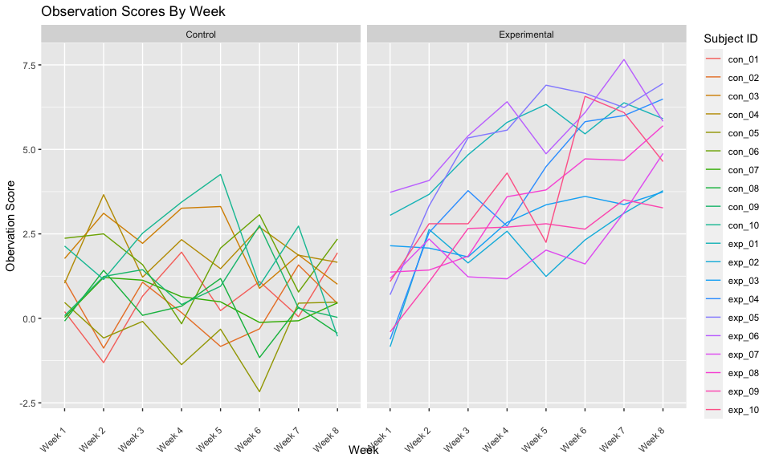

p8105\_hw5\_pm3148
================
Pooja Mukund
11/16/2021

``` r
#Load Libaries
library(tidyverse)
```

    ## ── Attaching packages ─────────────────────────────────────── tidyverse 1.3.1 ──

    ## ✓ ggplot2 3.3.5     ✓ purrr   0.3.4
    ## ✓ tibble  3.1.5     ✓ dplyr   1.0.7
    ## ✓ tidyr   1.1.3     ✓ stringr 1.4.0
    ## ✓ readr   2.0.1     ✓ forcats 0.5.1

    ## ── Conflicts ────────────────────────────────────────── tidyverse_conflicts() ──
    ## x dplyr::filter() masks stats::filter()
    ## x dplyr::lag()    masks stats::lag()

``` r
library(viridis)
```

    ## Loading required package: viridisLite

``` r
library(tools)
```

``` r
knitr::opts_chunk$set(
  fig.width = 10,
  fig.asp = .6,
  out.width = "90%"
)
```

# Problem 1

``` r
#Load Data
homicide<- read_csv("data/homicide-data.csv", na = c("", "Unknown"))
```

    ## Rows: 52179 Columns: 12

    ## ── Column specification ────────────────────────────────────────────────────────
    ## Delimiter: ","
    ## chr (8): uid, victim_last, victim_first, victim_race, victim_sex, city, stat...
    ## dbl (4): reported_date, victim_age, lat, lon

    ## 
    ## ℹ Use `spec()` to retrieve the full column specification for this data.
    ## ℹ Specify the column types or set `show_col_types = FALSE` to quiet this message.

``` r
#Describe the raw data. Create a city_state variable (e.g. “Baltimore, MD”) and then summarize within cities to obtain the total number of homicides and the number of unsolved homicides (those for which the disposition is “Closed without arrest” or “Open/No arrest”).
homicide_cln<-homicide%>%
  mutate(city_state = str_c(city, ",", state),
         resolution = case_when(disposition=="Closed without arrest" ~ "unsolved", 
                                disposition=="Open/No arrest" ~ "unsolved", 
                                disposition=="Closed by arrest" ~ "solved"))%>%
  relocate(city_state)%>%
  filter(city_state !="Tulsa,AL")
```

# Describe Data

``` r
nrow(homicide_cln)
```

    ## [1] 52178

``` r
ncol(homicide_cln)
```

    ## [1] 14

The homicide dataset is composed of 52178 variables and 14 observations.
Some interesting variables include city, state, and disposition, the
outcome of the homicide investigation. The raw data included values with
empty spaces and “Unknown” so those values were replaced with NAs to
make data cleaner.

``` r
#For the city of Baltimore, MD, use the prop.test function to estimate the proportion of homicides that are unsolved; save the output of prop.test as an R object, apply the broom::tidy to this object and pull the estimated proportion and confidence intervals from the resulting tidy dataframe.

baltimore_df<- homicide_cln%>%
 filter(city_state=="Baltimore,MD")

baltimore_summary<- baltimore_df%>%
  summarize(
    unsolved = sum(resolution=="unsolved"),
    n=n()
  )

baltimore_test<-prop.test(
          x = baltimore_summary%>%pull(unsolved), 
          n = baltimore_summary%>%pull(n)
          )

baltimore_test%>%
  broom::tidy()%>%
  knitr::kable()
```

|  estimate | statistic | p.value | parameter |  conf.low | conf.high | method                                               | alternative |
|----------:|----------:|--------:|----------:|----------:|----------:|:-----------------------------------------------------|:------------|
| 0.6455607 |   239.011 |       0 |         1 | 0.6275625 | 0.6631599 | 1-sample proportions test with continuity correction | two.sided   |

Total Number of Homicides and Number of Unresolved Homicides per City

``` r
homicide_cln%>%
  group_by(city_state)%>%
  summarize(
    unsolved = sum(resolution=="unsolved"),
    n=n()
  )%>%
  knitr::kable()
```

| city\_state       | unsolved |    n |
|:------------------|---------:|-----:|
| Albuquerque,NM    |      146 |  378 |
| Atlanta,GA        |      373 |  973 |
| Baltimore,MD      |     1825 | 2827 |
| Baton Rouge,LA    |      196 |  424 |
| Birmingham,AL     |      347 |  800 |
| Boston,MA         |      310 |  614 |
| Buffalo,NY        |      319 |  521 |
| Charlotte,NC      |      206 |  687 |
| Chicago,IL        |     4073 | 5535 |
| Cincinnati,OH     |      309 |  694 |
| Columbus,OH       |      575 | 1084 |
| Dallas,TX         |      754 | 1567 |
| Denver,CO         |      169 |  312 |
| Detroit,MI        |     1482 | 2519 |
| Durham,NC         |      101 |  276 |
| Fort Worth,TX     |      255 |  549 |
| Fresno,CA         |      169 |  487 |
| Houston,TX        |     1493 | 2942 |
| Indianapolis,IN   |      594 | 1322 |
| Jacksonville,FL   |      597 | 1168 |
| Kansas City,MO    |      486 | 1190 |
| Las Vegas,NV      |      572 | 1381 |
| Long Beach,CA     |      156 |  378 |
| Los Angeles,CA    |     1106 | 2257 |
| Louisville,KY     |      261 |  576 |
| Memphis,TN        |      483 | 1514 |
| Miami,FL          |      450 |  744 |
| Milwaukee,wI      |      403 | 1115 |
| Minneapolis,MN    |      187 |  366 |
| Nashville,TN      |      278 |  767 |
| New Orleans,LA    |      930 | 1434 |
| New York,NY       |      243 |  627 |
| Oakland,CA        |      508 |  947 |
| Oklahoma City,OK  |      326 |  672 |
| Omaha,NE          |      169 |  409 |
| Philadelphia,PA   |     1360 | 3037 |
| Phoenix,AZ        |      504 |  914 |
| Pittsburgh,PA     |      337 |  631 |
| Richmond,VA       |      113 |  429 |
| Sacramento,CA     |      139 |  376 |
| San Antonio,TX    |      357 |  833 |
| San Bernardino,CA |      170 |  275 |
| San Diego,CA      |      175 |  461 |
| San Francisco,CA  |      336 |  663 |
| Savannah,GA       |      115 |  246 |
| St. Louis,MO      |      905 | 1677 |
| Stockton,CA       |      266 |  444 |
| Tampa,FL          |       95 |  208 |
| Tulsa,OK          |      193 |  583 |
| Washington,DC     |      589 | 1345 |

# Create prop test function

``` r
prop_test_function<-function(city_df){
  city_summary = 
    city_df%>%
    summarize(
      unsolved = sum(resolution=="unsolved"),
    n=n()
  )
  
  city_test = 
    prop.test(x = city_summary%>%pull(unsolved), 
          n = city_summary%>%pull(n))
  return(city_test)
}

prop_test_function(baltimore_df)
```

    ## 
    ##  1-sample proportions test with continuity correction
    ## 
    ## data:  city_summary %>% pull(unsolved) out of city_summary %>% pull(n), null probability 0.5
    ## X-squared = 239.01, df = 1, p-value < 2.2e-16
    ## alternative hypothesis: true p is not equal to 0.5
    ## 95 percent confidence interval:
    ##  0.6275625 0.6631599
    ## sample estimates:
    ##         p 
    ## 0.6455607

# Iterate over entire dataset

``` r
nested_df<-
  homicide_cln%>%
  nest(data = uid:resolution)%>%
  mutate(test_results = map(data, prop_test_function),
         tidy_results = map(test_results, broom::tidy))

nested_df%>%
  filter(city_state=="Baltimore,MD")%>%
  pull(tidy_results)
```

    ## [[1]]
    ## # A tibble: 1 × 8
    ##   estimate statistic  p.value parameter conf.low conf.high method    alternative
    ##      <dbl>     <dbl>    <dbl>     <int>    <dbl>     <dbl> <chr>     <chr>      
    ## 1    0.646      239. 6.46e-54         1    0.628     0.663 1-sample… two.sided

``` r
results_df<-
  homicide_cln%>%
  nest(data = uid:resolution)%>%
  mutate(test_results = map(data, prop_test_function),
         tidy_results = map(test_results, broom::tidy))%>%
  select(city_state, tidy_results)%>%
  unnest(tidy_results)%>%
  select(city_state, estimate, starts_with("conf"))

#Final Tidy Dataframe with Estimated Proportions and CI for each City
results_df%>%
  knitr::kable()
```

| city\_state       |  estimate |  conf.low | conf.high |
|:------------------|----------:|----------:|----------:|
| Albuquerque,NM    | 0.3862434 | 0.3372604 | 0.4375766 |
| Atlanta,GA        | 0.3833505 | 0.3528119 | 0.4148219 |
| Baltimore,MD      | 0.6455607 | 0.6275625 | 0.6631599 |
| Baton Rouge,LA    | 0.4622642 | 0.4141987 | 0.5110240 |
| Birmingham,AL     | 0.4337500 | 0.3991889 | 0.4689557 |
| Boston,MA         | 0.5048860 | 0.4646219 | 0.5450881 |
| Buffalo,NY        | 0.6122841 | 0.5687990 | 0.6540879 |
| Charlotte,NC      | 0.2998544 | 0.2660820 | 0.3358999 |
| Chicago,IL        | 0.7358627 | 0.7239959 | 0.7473998 |
| Cincinnati,OH     | 0.4452450 | 0.4079606 | 0.4831439 |
| Columbus,OH       | 0.5304428 | 0.5002167 | 0.5604506 |
| Dallas,TX         | 0.4811742 | 0.4561942 | 0.5062475 |
| Denver,CO         | 0.5416667 | 0.4846098 | 0.5976807 |
| Detroit,MI        | 0.5883287 | 0.5687903 | 0.6075953 |
| Durham,NC         | 0.3659420 | 0.3095874 | 0.4260936 |
| Fort Worth,TX     | 0.4644809 | 0.4222542 | 0.5072119 |
| Fresno,CA         | 0.3470226 | 0.3051013 | 0.3913963 |
| Houston,TX        | 0.5074779 | 0.4892447 | 0.5256914 |
| Indianapolis,IN   | 0.4493192 | 0.4223156 | 0.4766207 |
| Jacksonville,FL   | 0.5111301 | 0.4820460 | 0.5401402 |
| Kansas City,MO    | 0.4084034 | 0.3803996 | 0.4370054 |
| Las Vegas,NV      | 0.4141926 | 0.3881284 | 0.4407395 |
| Long Beach,CA     | 0.4126984 | 0.3629026 | 0.4642973 |
| Los Angeles,CA    | 0.4900310 | 0.4692208 | 0.5108754 |
| Louisville,KY     | 0.4531250 | 0.4120609 | 0.4948235 |
| Memphis,TN        | 0.3190225 | 0.2957047 | 0.3432691 |
| Miami,FL          | 0.6048387 | 0.5685783 | 0.6400015 |
| Milwaukee,wI      | 0.3614350 | 0.3333172 | 0.3905194 |
| Minneapolis,MN    | 0.5109290 | 0.4585150 | 0.5631099 |
| Nashville,TN      | 0.3624511 | 0.3285592 | 0.3977401 |
| New Orleans,LA    | 0.6485356 | 0.6231048 | 0.6731615 |
| New York,NY       | 0.3875598 | 0.3494421 | 0.4270755 |
| Oakland,CA        | 0.5364308 | 0.5040588 | 0.5685037 |
| Oklahoma City,OK  | 0.4851190 | 0.4467861 | 0.5236245 |
| Omaha,NE          | 0.4132029 | 0.3653146 | 0.4627477 |
| Philadelphia,PA   | 0.4478103 | 0.4300380 | 0.4657157 |
| Phoenix,AZ        | 0.5514223 | 0.5184825 | 0.5839244 |
| Pittsburgh,PA     | 0.5340729 | 0.4942706 | 0.5734545 |
| Richmond,VA       | 0.2634033 | 0.2228571 | 0.3082658 |
| San Antonio,TX    | 0.4285714 | 0.3947772 | 0.4630331 |
| Sacramento,CA     | 0.3696809 | 0.3211559 | 0.4209131 |
| Savannah,GA       | 0.4674797 | 0.4041252 | 0.5318665 |
| San Bernardino,CA | 0.6181818 | 0.5576628 | 0.6753422 |
| San Diego,CA      | 0.3796095 | 0.3354259 | 0.4258315 |
| San Francisco,CA  | 0.5067873 | 0.4680516 | 0.5454433 |
| St. Louis,MO      | 0.5396541 | 0.5154369 | 0.5636879 |
| Stockton,CA       | 0.5990991 | 0.5517145 | 0.6447418 |
| Tampa,FL          | 0.4567308 | 0.3881009 | 0.5269851 |
| Tulsa,OK          | 0.3310463 | 0.2932349 | 0.3711192 |
| Washington,DC     | 0.4379182 | 0.4112495 | 0.4649455 |

Make plot with Geom Error Bar

``` r
results_df%>%
  mutate(city_state = fct_reorder(city_state, estimate))%>%
  ggplot(aes(x = city_state, y=estimate)) + 
  geom_point()+
  geom_errorbar(aes(ymin = conf.low, ymax = conf.high))+
  theme(axis.text.x = element_text(angle = 90, vjust=0.5, hjust=1))+xlab("City,State")+ylab("Proportion Estimate")
```



# Problem 2

``` r
file_path = "data/study"
files<-list.files(path = file_path, full.names = FALSE)

study_cln<-
  tibble(filename = files)%>%
  mutate(file_contents = map(filename, ~ read_csv(file.path("data/study", .))),
         arm = str_extract(filename, "con|exp"),
         subject_id =file_path_sans_ext(filename))%>%
  unnest(file_contents)%>%
  select(-filename)%>%
  relocate(subject_id, arm)%>%
  pivot_longer(
    week_1:week_8, 
    names_to = "week",
    values_to = "observation_score"
  )%>%
  mutate(
         week = replace(week, week == "week_1", "Week 1"),
         week = replace(week, week == "week_2", "Week 2"),
         week = replace(week, week == "week_3", "Week 3"),
         week = replace(week, week == "week_4", "Week 4"),
         week = replace(week, week == "week_5", "Week 5"),
         week = replace(week, week == "week_6", "Week 6"),
         week = replace(week, week == "week_7", "Week 7"),
         week = replace(week, week == "week_8", "Week 8"),
         week = factor(week, levels=c("Week 1", "Week 2","Week 3","Week 4","Week 5","Week 6","Week 7","Week 8")),
         arm = replace(arm, arm=="con", "Control"), 
         arm = replace(arm, arm=="exp", "Experimental"))

study_cln%>%
  knitr::kable()
```

| subject\_id | arm          | week   | observation\_score |
|:------------|:-------------|:-------|-------------------:|
| con\_01     | Control      | Week 1 |               0.20 |
| con\_01     | Control      | Week 2 |              -1.31 |
| con\_01     | Control      | Week 3 |               0.66 |
| con\_01     | Control      | Week 4 |               1.96 |
| con\_01     | Control      | Week 5 |               0.23 |
| con\_01     | Control      | Week 6 |               1.09 |
| con\_01     | Control      | Week 7 |               0.05 |
| con\_01     | Control      | Week 8 |               1.94 |
| con\_02     | Control      | Week 1 |               1.13 |
| con\_02     | Control      | Week 2 |              -0.88 |
| con\_02     | Control      | Week 3 |               1.07 |
| con\_02     | Control      | Week 4 |               0.17 |
| con\_02     | Control      | Week 5 |              -0.83 |
| con\_02     | Control      | Week 6 |              -0.31 |
| con\_02     | Control      | Week 7 |               1.58 |
| con\_02     | Control      | Week 8 |               0.44 |
| con\_03     | Control      | Week 1 |               1.77 |
| con\_03     | Control      | Week 2 |               3.11 |
| con\_03     | Control      | Week 3 |               2.22 |
| con\_03     | Control      | Week 4 |               3.26 |
| con\_03     | Control      | Week 5 |               3.31 |
| con\_03     | Control      | Week 6 |               0.89 |
| con\_03     | Control      | Week 7 |               1.88 |
| con\_03     | Control      | Week 8 |               1.01 |
| con\_04     | Control      | Week 1 |               1.04 |
| con\_04     | Control      | Week 2 |               3.66 |
| con\_04     | Control      | Week 3 |               1.22 |
| con\_04     | Control      | Week 4 |               2.33 |
| con\_04     | Control      | Week 5 |               1.47 |
| con\_04     | Control      | Week 6 |               2.70 |
| con\_04     | Control      | Week 7 |               1.87 |
| con\_04     | Control      | Week 8 |               1.66 |
| con\_05     | Control      | Week 1 |               0.47 |
| con\_05     | Control      | Week 2 |              -0.58 |
| con\_05     | Control      | Week 3 |              -0.09 |
| con\_05     | Control      | Week 4 |              -1.37 |
| con\_05     | Control      | Week 5 |              -0.32 |
| con\_05     | Control      | Week 6 |              -2.17 |
| con\_05     | Control      | Week 7 |               0.45 |
| con\_05     | Control      | Week 8 |               0.48 |
| con\_06     | Control      | Week 1 |               2.37 |
| con\_06     | Control      | Week 2 |               2.50 |
| con\_06     | Control      | Week 3 |               1.59 |
| con\_06     | Control      | Week 4 |              -0.16 |
| con\_06     | Control      | Week 5 |               2.08 |
| con\_06     | Control      | Week 6 |               3.07 |
| con\_06     | Control      | Week 7 |               0.78 |
| con\_06     | Control      | Week 8 |               2.35 |
| con\_07     | Control      | Week 1 |               0.03 |
| con\_07     | Control      | Week 2 |               1.21 |
| con\_07     | Control      | Week 3 |               1.13 |
| con\_07     | Control      | Week 4 |               0.64 |
| con\_07     | Control      | Week 5 |               0.49 |
| con\_07     | Control      | Week 6 |              -0.12 |
| con\_07     | Control      | Week 7 |              -0.07 |
| con\_07     | Control      | Week 8 |               0.46 |
| con\_08     | Control      | Week 1 |              -0.08 |
| con\_08     | Control      | Week 2 |               1.42 |
| con\_08     | Control      | Week 3 |               0.09 |
| con\_08     | Control      | Week 4 |               0.36 |
| con\_08     | Control      | Week 5 |               1.18 |
| con\_08     | Control      | Week 6 |              -1.16 |
| con\_08     | Control      | Week 7 |               0.33 |
| con\_08     | Control      | Week 8 |              -0.44 |
| con\_09     | Control      | Week 1 |               0.08 |
| con\_09     | Control      | Week 2 |               1.24 |
| con\_09     | Control      | Week 3 |               1.44 |
| con\_09     | Control      | Week 4 |               0.41 |
| con\_09     | Control      | Week 5 |               0.95 |
| con\_09     | Control      | Week 6 |               2.75 |
| con\_09     | Control      | Week 7 |               0.30 |
| con\_09     | Control      | Week 8 |               0.03 |
| con\_10     | Control      | Week 1 |               2.14 |
| con\_10     | Control      | Week 2 |               1.15 |
| con\_10     | Control      | Week 3 |               2.52 |
| con\_10     | Control      | Week 4 |               3.44 |
| con\_10     | Control      | Week 5 |               4.26 |
| con\_10     | Control      | Week 6 |               0.97 |
| con\_10     | Control      | Week 7 |               2.73 |
| con\_10     | Control      | Week 8 |              -0.53 |
| exp\_01     | Experimental | Week 1 |               3.05 |
| exp\_01     | Experimental | Week 2 |               3.67 |
| exp\_01     | Experimental | Week 3 |               4.84 |
| exp\_01     | Experimental | Week 4 |               5.80 |
| exp\_01     | Experimental | Week 5 |               6.33 |
| exp\_01     | Experimental | Week 6 |               5.46 |
| exp\_01     | Experimental | Week 7 |               6.38 |
| exp\_01     | Experimental | Week 8 |               5.91 |
| exp\_02     | Experimental | Week 1 |              -0.84 |
| exp\_02     | Experimental | Week 2 |               2.63 |
| exp\_02     | Experimental | Week 3 |               1.64 |
| exp\_02     | Experimental | Week 4 |               2.58 |
| exp\_02     | Experimental | Week 5 |               1.24 |
| exp\_02     | Experimental | Week 6 |               2.32 |
| exp\_02     | Experimental | Week 7 |               3.11 |
| exp\_02     | Experimental | Week 8 |               3.78 |
| exp\_03     | Experimental | Week 1 |               2.15 |
| exp\_03     | Experimental | Week 2 |               2.08 |
| exp\_03     | Experimental | Week 3 |               1.82 |
| exp\_03     | Experimental | Week 4 |               2.84 |
| exp\_03     | Experimental | Week 5 |               3.36 |
| exp\_03     | Experimental | Week 6 |               3.61 |
| exp\_03     | Experimental | Week 7 |               3.37 |
| exp\_03     | Experimental | Week 8 |               3.74 |
| exp\_04     | Experimental | Week 1 |              -0.62 |
| exp\_04     | Experimental | Week 2 |               2.54 |
| exp\_04     | Experimental | Week 3 |               3.78 |
| exp\_04     | Experimental | Week 4 |               2.73 |
| exp\_04     | Experimental | Week 5 |               4.49 |
| exp\_04     | Experimental | Week 6 |               5.82 |
| exp\_04     | Experimental | Week 7 |               6.00 |
| exp\_04     | Experimental | Week 8 |               6.49 |
| exp\_05     | Experimental | Week 1 |               0.70 |
| exp\_05     | Experimental | Week 2 |               3.33 |
| exp\_05     | Experimental | Week 3 |               5.34 |
| exp\_05     | Experimental | Week 4 |               5.57 |
| exp\_05     | Experimental | Week 5 |               6.90 |
| exp\_05     | Experimental | Week 6 |               6.66 |
| exp\_05     | Experimental | Week 7 |               6.24 |
| exp\_05     | Experimental | Week 8 |               6.95 |
| exp\_06     | Experimental | Week 1 |               3.73 |
| exp\_06     | Experimental | Week 2 |               4.08 |
| exp\_06     | Experimental | Week 3 |               5.40 |
| exp\_06     | Experimental | Week 4 |               6.41 |
| exp\_06     | Experimental | Week 5 |               4.87 |
| exp\_06     | Experimental | Week 6 |               6.09 |
| exp\_06     | Experimental | Week 7 |               7.66 |
| exp\_06     | Experimental | Week 8 |               5.83 |
| exp\_07     | Experimental | Week 1 |               1.18 |
| exp\_07     | Experimental | Week 2 |               2.35 |
| exp\_07     | Experimental | Week 3 |               1.23 |
| exp\_07     | Experimental | Week 4 |               1.17 |
| exp\_07     | Experimental | Week 5 |               2.02 |
| exp\_07     | Experimental | Week 6 |               1.61 |
| exp\_07     | Experimental | Week 7 |               3.13 |
| exp\_07     | Experimental | Week 8 |               4.88 |
| exp\_08     | Experimental | Week 1 |               1.37 |
| exp\_08     | Experimental | Week 2 |               1.43 |
| exp\_08     | Experimental | Week 3 |               1.84 |
| exp\_08     | Experimental | Week 4 |               3.60 |
| exp\_08     | Experimental | Week 5 |               3.80 |
| exp\_08     | Experimental | Week 6 |               4.72 |
| exp\_08     | Experimental | Week 7 |               4.68 |
| exp\_08     | Experimental | Week 8 |               5.70 |
| exp\_09     | Experimental | Week 1 |              -0.40 |
| exp\_09     | Experimental | Week 2 |               1.08 |
| exp\_09     | Experimental | Week 3 |               2.66 |
| exp\_09     | Experimental | Week 4 |               2.70 |
| exp\_09     | Experimental | Week 5 |               2.80 |
| exp\_09     | Experimental | Week 6 |               2.64 |
| exp\_09     | Experimental | Week 7 |               3.51 |
| exp\_09     | Experimental | Week 8 |               3.27 |
| exp\_10     | Experimental | Week 1 |               1.09 |
| exp\_10     | Experimental | Week 2 |               2.80 |
| exp\_10     | Experimental | Week 3 |               2.80 |
| exp\_10     | Experimental | Week 4 |               4.30 |
| exp\_10     | Experimental | Week 5 |               2.25 |
| exp\_10     | Experimental | Week 6 |               6.57 |
| exp\_10     | Experimental | Week 7 |               6.09 |
| exp\_10     | Experimental | Week 8 |               4.64 |

Spagetti Plot

``` r
#Make a spaghetti plot showing observations on each subject over time, and comment on differences between groups.
study_cln%>%
  ggplot(aes(x = week, y = observation_score, group = subject_id, color = subject_id))+geom_line()+facet_wrap(~ arm)+
  theme(axis.text.x = element_text(angle = 45, vjust=0.5, hjust=1))+
  scale_color_discrete(name = "Subject ID")+
  xlab("Week")+
  ylab("Obervation Score") +
  ggtitle("Observation Scores By Week")
```



Subjects in the experimental group tend to have a positive linear trend
in regards to their observation scores, where the observation scores are
increasing over time. However, in the control group there does not seem
to be a clear trend. It looks like, for many of the subjects, if we were
to add a trend line it would likely be with a slope that is close to 0,
indicating that the control procedure does not have any effect on
observation score.

# Problem 3

``` r
#Set up for data set with NAs
set.seed(10)

iris_with_missing = iris %>% 
  map_df(~replace(.x, sample(1:150, 20), NA)) %>%
  mutate(Species = as.character(Species))
```

Write function to fill in missing values

``` r
fill_in_missing = function(vectorvar){
  if(is.numeric(vectorvar)){
    vectorvar = replace_na(vectorvar, mean(vectorvar, na.rm=TRUE))
  }
  if(is.character(vectorvar)){
    vectorvar = replace_na(vectorvar, "virginica")
  }
  return(vectorvar)
}

#Case Numeric - Test
fill_in_missing(iris_with_missing$Petal.Width)
```

    ##   [1] 0.200000 0.200000 0.200000 1.192308 0.200000 0.400000 0.300000 0.200000
    ##   [9] 0.200000 0.100000 0.200000 0.200000 0.100000 0.100000 0.200000 0.400000
    ##  [17] 0.400000 1.192308 0.300000 1.192308 0.200000 0.400000 0.200000 0.500000
    ##  [25] 0.200000 0.200000 0.400000 0.200000 0.200000 0.200000 0.200000 0.400000
    ##  [33] 0.100000 0.200000 0.200000 0.200000 0.200000 0.100000 1.192308 0.200000
    ##  [41] 0.300000 1.192308 0.200000 0.600000 0.400000 0.300000 0.200000 0.200000
    ##  [49] 0.200000 0.200000 1.400000 1.500000 1.500000 1.300000 1.500000 1.300000
    ##  [57] 1.600000 1.000000 1.300000 1.400000 1.000000 1.500000 1.192308 1.400000
    ##  [65] 1.300000 1.400000 1.500000 1.000000 1.500000 1.100000 1.800000 1.300000
    ##  [73] 1.500000 1.200000 1.300000 1.400000 1.400000 1.192308 1.192308 1.000000
    ##  [81] 1.100000 1.000000 1.200000 1.600000 1.500000 1.600000 1.192308 1.300000
    ##  [89] 1.192308 1.192308 1.200000 1.192308 1.192308 1.192308 1.300000 1.200000
    ##  [97] 1.300000 1.300000 1.192308 1.300000 2.500000 1.900000 2.100000 1.800000
    ## [105] 2.200000 2.100000 1.700000 1.800000 1.800000 2.500000 2.000000 1.900000
    ## [113] 2.100000 2.000000 2.400000 2.300000 1.800000 1.192308 2.300000 1.500000
    ## [121] 1.192308 2.000000 2.000000 1.800000 2.100000 1.800000 1.800000 1.800000
    ## [129] 2.100000 1.600000 1.192308 2.000000 2.200000 1.500000 1.400000 2.300000
    ## [137] 1.192308 1.192308 1.800000 2.100000 2.400000 2.300000 1.900000 2.300000
    ## [145] 2.500000 2.300000 1.900000 2.000000 2.300000 1.800000

``` r
#Case Character - Test
fill_in_missing(iris_with_missing$Species)
```

    ##   [1] "setosa"     "setosa"     "setosa"     "setosa"     "setosa"    
    ##   [6] "setosa"     "setosa"     "setosa"     "setosa"     "setosa"    
    ##  [11] "setosa"     "setosa"     "setosa"     "setosa"     "setosa"    
    ##  [16] "setosa"     "setosa"     "setosa"     "setosa"     "setosa"    
    ##  [21] "setosa"     "virginica"  "setosa"     "setosa"     "virginica" 
    ##  [26] "setosa"     "virginica"  "setosa"     "setosa"     "setosa"    
    ##  [31] "setosa"     "setosa"     "setosa"     "setosa"     "setosa"    
    ##  [36] "setosa"     "setosa"     "setosa"     "setosa"     "setosa"    
    ##  [41] "setosa"     "virginica"  "setosa"     "setosa"     "setosa"    
    ##  [46] "virginica"  "setosa"     "setosa"     "setosa"     "setosa"    
    ##  [51] "virginica"  "versicolor" "versicolor" "versicolor" "versicolor"
    ##  [56] "versicolor" "virginica"  "versicolor" "virginica"  "versicolor"
    ##  [61] "versicolor" "versicolor" "versicolor" "versicolor" "versicolor"
    ##  [66] "versicolor" "versicolor" "versicolor" "versicolor" "versicolor"
    ##  [71] "versicolor" "virginica"  "versicolor" "versicolor" "versicolor"
    ##  [76] "versicolor" "versicolor" "versicolor" "versicolor" "virginica" 
    ##  [81] "versicolor" "versicolor" "versicolor" "versicolor" "versicolor"
    ##  [86] "versicolor" "versicolor" "versicolor" "versicolor" "versicolor"
    ##  [91] "versicolor" "versicolor" "versicolor" "virginica"  "versicolor"
    ##  [96] "versicolor" "versicolor" "versicolor" "versicolor" "virginica" 
    ## [101] "virginica"  "virginica"  "virginica"  "virginica"  "virginica" 
    ## [106] "virginica"  "virginica"  "virginica"  "virginica"  "virginica" 
    ## [111] "virginica"  "virginica"  "virginica"  "virginica"  "virginica" 
    ## [116] "virginica"  "virginica"  "virginica"  "virginica"  "virginica" 
    ## [121] "virginica"  "virginica"  "virginica"  "virginica"  "virginica" 
    ## [126] "virginica"  "virginica"  "virginica"  "virginica"  "virginica" 
    ## [131] "virginica"  "virginica"  "virginica"  "virginica"  "virginica" 
    ## [136] "virginica"  "virginica"  "virginica"  "virginica"  "virginica" 
    ## [141] "virginica"  "virginica"  "virginica"  "virginica"  "virginica" 
    ## [146] "virginica"  "virginica"  "virginica"  "virginica"  "virginica"

Apply to entire dataset

``` r
iris_with_missing%>%
  map_df(~fill_in_missing(.x))%>%
summarise_all(funs(sum(is.na(.))))
```

    ## Warning: `funs()` was deprecated in dplyr 0.8.0.
    ## Please use a list of either functions or lambdas: 
    ## 
    ##   # Simple named list: 
    ##   list(mean = mean, median = median)
    ## 
    ##   # Auto named with `tibble::lst()`: 
    ##   tibble::lst(mean, median)
    ## 
    ##   # Using lambdas
    ##   list(~ mean(., trim = .2), ~ median(., na.rm = TRUE))
    ## This warning is displayed once every 8 hours.
    ## Call `lifecycle::last_lifecycle_warnings()` to see where this warning was generated.

    ## # A tibble: 1 × 5
    ##   Sepal.Length Sepal.Width Petal.Length Petal.Width Species
    ##          <int>       <int>        <int>       <int>   <int>
    ## 1            0           0            0           0       0

``` r
#No more NAs in all columns

iris_no_na<- iris_with_missing%>%
  map_df(~fill_in_missing(.x))

iris_no_na%>%
  knitr::kable()
```

| Sepal.Length | Sepal.Width | Petal.Length | Petal.Width | Species    |
|-------------:|------------:|-------------:|------------:|:-----------|
|     5.100000 |    3.500000 |     1.400000 |    0.200000 | setosa     |
|     4.900000 |    3.000000 |     1.400000 |    0.200000 | setosa     |
|     4.700000 |    3.200000 |     1.300000 |    0.200000 | setosa     |
|     4.600000 |    3.100000 |     1.500000 |    1.192308 | setosa     |
|     5.000000 |    3.600000 |     1.400000 |    0.200000 | setosa     |
|     5.400000 |    3.900000 |     1.700000 |    0.400000 | setosa     |
|     5.819231 |    3.400000 |     1.400000 |    0.300000 | setosa     |
|     5.000000 |    3.400000 |     1.500000 |    0.200000 | setosa     |
|     4.400000 |    2.900000 |     1.400000 |    0.200000 | setosa     |
|     4.900000 |    3.100000 |     3.765385 |    0.100000 | setosa     |
|     5.400000 |    3.075385 |     1.500000 |    0.200000 | setosa     |
|     4.800000 |    3.400000 |     1.600000 |    0.200000 | setosa     |
|     5.819231 |    3.075385 |     1.400000 |    0.100000 | setosa     |
|     4.300000 |    3.000000 |     3.765385 |    0.100000 | setosa     |
|     5.819231 |    4.000000 |     3.765385 |    0.200000 | setosa     |
|     5.700000 |    4.400000 |     1.500000 |    0.400000 | setosa     |
|     5.400000 |    3.900000 |     1.300000 |    0.400000 | setosa     |
|     5.100000 |    3.500000 |     1.400000 |    1.192308 | setosa     |
|     5.700000 |    3.800000 |     1.700000 |    0.300000 | setosa     |
|     5.100000 |    3.800000 |     1.500000 |    1.192308 | setosa     |
|     5.400000 |    3.400000 |     1.700000 |    0.200000 | setosa     |
|     5.100000 |    3.700000 |     1.500000 |    0.400000 | virginica  |
|     4.600000 |    3.600000 |     1.000000 |    0.200000 | setosa     |
|     5.819231 |    3.300000 |     3.765385 |    0.500000 | setosa     |
|     4.800000 |    3.400000 |     1.900000 |    0.200000 | virginica  |
|     5.000000 |    3.000000 |     3.765385 |    0.200000 | setosa     |
|     5.000000 |    3.400000 |     1.600000 |    0.400000 | virginica  |
|     5.200000 |    3.500000 |     1.500000 |    0.200000 | setosa     |
|     5.819231 |    3.400000 |     1.400000 |    0.200000 | setosa     |
|     4.700000 |    3.200000 |     1.600000 |    0.200000 | setosa     |
|     4.800000 |    3.100000 |     3.765385 |    0.200000 | setosa     |
|     5.400000 |    3.075385 |     1.500000 |    0.400000 | setosa     |
|     5.200000 |    3.075385 |     1.500000 |    0.100000 | setosa     |
|     5.500000 |    4.200000 |     1.400000 |    0.200000 | setosa     |
|     4.900000 |    3.100000 |     3.765385 |    0.200000 | setosa     |
|     5.000000 |    3.200000 |     1.200000 |    0.200000 | setosa     |
|     5.500000 |    3.500000 |     1.300000 |    0.200000 | setosa     |
|     4.900000 |    3.600000 |     1.400000 |    0.100000 | setosa     |
|     4.400000 |    3.000000 |     1.300000 |    1.192308 | setosa     |
|     5.100000 |    3.400000 |     1.500000 |    0.200000 | setosa     |
|     5.000000 |    3.500000 |     1.300000 |    0.300000 | setosa     |
|     4.500000 |    3.075385 |     1.300000 |    1.192308 | virginica  |
|     4.400000 |    3.200000 |     1.300000 |    0.200000 | setosa     |
|     5.000000 |    3.500000 |     1.600000 |    0.600000 | setosa     |
|     5.100000 |    3.800000 |     1.900000 |    0.400000 | setosa     |
|     4.800000 |    3.000000 |     1.400000 |    0.300000 | virginica  |
|     5.100000 |    3.800000 |     1.600000 |    0.200000 | setosa     |
|     4.600000 |    3.200000 |     3.765385 |    0.200000 | setosa     |
|     5.300000 |    3.700000 |     1.500000 |    0.200000 | setosa     |
|     5.000000 |    3.075385 |     1.400000 |    0.200000 | setosa     |
|     7.000000 |    3.075385 |     4.700000 |    1.400000 | virginica  |
|     6.400000 |    3.200000 |     4.500000 |    1.500000 | versicolor |
|     6.900000 |    3.100000 |     4.900000 |    1.500000 | versicolor |
|     5.500000 |    2.300000 |     4.000000 |    1.300000 | versicolor |
|     6.500000 |    2.800000 |     4.600000 |    1.500000 | versicolor |
|     5.700000 |    2.800000 |     4.500000 |    1.300000 | versicolor |
|     6.300000 |    3.300000 |     4.700000 |    1.600000 | virginica  |
|     4.900000 |    2.400000 |     3.765385 |    1.000000 | versicolor |
|     6.600000 |    2.900000 |     4.600000 |    1.300000 | virginica  |
|     5.200000 |    2.700000 |     3.900000 |    1.400000 | versicolor |
|     5.000000 |    2.000000 |     3.765385 |    1.000000 | versicolor |
|     5.900000 |    3.000000 |     4.200000 |    1.500000 | versicolor |
|     6.000000 |    2.200000 |     4.000000 |    1.192308 | versicolor |
|     6.100000 |    2.900000 |     4.700000 |    1.400000 | versicolor |
|     5.600000 |    2.900000 |     3.600000 |    1.300000 | versicolor |
|     6.700000 |    3.100000 |     4.400000 |    1.400000 | versicolor |
|     5.600000 |    3.000000 |     4.500000 |    1.500000 | versicolor |
|     5.800000 |    3.075385 |     4.100000 |    1.000000 | versicolor |
|     6.200000 |    2.200000 |     4.500000 |    1.500000 | versicolor |
|     5.600000 |    2.500000 |     3.900000 |    1.100000 | versicolor |
|     5.900000 |    3.200000 |     4.800000 |    1.800000 | versicolor |
|     5.819231 |    2.800000 |     4.000000 |    1.300000 | virginica  |
|     6.300000 |    2.500000 |     4.900000 |    1.500000 | versicolor |
|     5.819231 |    2.800000 |     3.765385 |    1.200000 | versicolor |
|     6.400000 |    2.900000 |     4.300000 |    1.300000 | versicolor |
|     6.600000 |    3.000000 |     4.400000 |    1.400000 | versicolor |
|     6.800000 |    2.800000 |     4.800000 |    1.400000 | versicolor |
|     6.700000 |    3.075385 |     5.000000 |    1.192308 | versicolor |
|     6.000000 |    3.075385 |     4.500000 |    1.192308 | versicolor |
|     5.700000 |    2.600000 |     3.500000 |    1.000000 | virginica  |
|     5.500000 |    2.400000 |     3.800000 |    1.100000 | versicolor |
|     5.819231 |    2.400000 |     3.700000 |    1.000000 | versicolor |
|     5.800000 |    2.700000 |     3.900000 |    1.200000 | versicolor |
|     6.000000 |    2.700000 |     5.100000 |    1.600000 | versicolor |
|     5.400000 |    3.000000 |     4.500000 |    1.500000 | versicolor |
|     5.819231 |    3.400000 |     4.500000 |    1.600000 | versicolor |
|     6.700000 |    3.100000 |     4.700000 |    1.192308 | versicolor |
|     5.819231 |    3.075385 |     4.400000 |    1.300000 | versicolor |
|     5.600000 |    3.000000 |     3.765385 |    1.192308 | versicolor |
|     5.500000 |    2.500000 |     4.000000 |    1.192308 | versicolor |
|     5.500000 |    3.075385 |     4.400000 |    1.200000 | versicolor |
|     5.819231 |    3.075385 |     4.600000 |    1.192308 | versicolor |
|     5.800000 |    3.075385 |     4.000000 |    1.192308 | versicolor |
|     5.000000 |    2.300000 |     3.300000 |    1.192308 | virginica  |
|     5.819231 |    2.700000 |     4.200000 |    1.300000 | versicolor |
|     5.700000 |    3.000000 |     4.200000 |    1.200000 | versicolor |
|     5.700000 |    2.900000 |     4.200000 |    1.300000 | versicolor |
|     6.200000 |    2.900000 |     4.300000 |    1.300000 | versicolor |
|     5.100000 |    2.500000 |     3.000000 |    1.192308 | versicolor |
|     5.700000 |    2.800000 |     4.100000 |    1.300000 | virginica  |
|     6.300000 |    3.075385 |     3.765385 |    2.500000 | virginica  |
|     5.800000 |    2.700000 |     5.100000 |    1.900000 | virginica  |
|     7.100000 |    3.000000 |     5.900000 |    2.100000 | virginica  |
|     6.300000 |    2.900000 |     5.600000 |    1.800000 | virginica  |
|     6.500000 |    3.075385 |     5.800000 |    2.200000 | virginica  |
|     7.600000 |    3.000000 |     6.600000 |    2.100000 | virginica  |
|     4.900000 |    2.500000 |     4.500000 |    1.700000 | virginica  |
|     7.300000 |    2.900000 |     6.300000 |    1.800000 | virginica  |
|     6.700000 |    3.075385 |     3.765385 |    1.800000 | virginica  |
|     5.819231 |    3.600000 |     3.765385 |    2.500000 | virginica  |
|     6.500000 |    3.200000 |     5.100000 |    2.000000 | virginica  |
|     5.819231 |    2.700000 |     5.300000 |    1.900000 | virginica  |
|     6.800000 |    3.000000 |     5.500000 |    2.100000 | virginica  |
|     5.700000 |    3.075385 |     5.000000 |    2.000000 | virginica  |
|     5.800000 |    2.800000 |     5.100000 |    2.400000 | virginica  |
|     6.400000 |    3.200000 |     5.300000 |    2.300000 | virginica  |
|     6.500000 |    3.000000 |     3.765385 |    1.800000 | virginica  |
|     7.700000 |    3.800000 |     6.700000 |    1.192308 | virginica  |
|     7.700000 |    2.600000 |     6.900000 |    2.300000 | virginica  |
|     6.000000 |    2.200000 |     5.000000 |    1.500000 | virginica  |
|     5.819231 |    3.200000 |     5.700000 |    1.192308 | virginica  |
|     5.600000 |    3.075385 |     4.900000 |    2.000000 | virginica  |
|     7.700000 |    2.800000 |     6.700000 |    2.000000 | virginica  |
|     6.300000 |    2.700000 |     4.900000 |    1.800000 | virginica  |
|     6.700000 |    3.300000 |     5.700000 |    2.100000 | virginica  |
|     7.200000 |    3.200000 |     6.000000 |    1.800000 | virginica  |
|     6.200000 |    2.800000 |     4.800000 |    1.800000 | virginica  |
|     6.100000 |    3.000000 |     4.900000 |    1.800000 | virginica  |
|     6.400000 |    2.800000 |     5.600000 |    2.100000 | virginica  |
|     7.200000 |    3.000000 |     5.800000 |    1.600000 | virginica  |
|     7.400000 |    2.800000 |     6.100000 |    1.192308 | virginica  |
|     7.900000 |    3.800000 |     3.765385 |    2.000000 | virginica  |
|     6.400000 |    2.800000 |     3.765385 |    2.200000 | virginica  |
|     5.819231 |    2.800000 |     5.100000 |    1.500000 | virginica  |
|     6.100000 |    3.075385 |     5.600000 |    1.400000 | virginica  |
|     5.819231 |    3.000000 |     6.100000 |    2.300000 | virginica  |
|     5.819231 |    3.400000 |     5.600000 |    1.192308 | virginica  |
|     6.400000 |    3.100000 |     5.500000 |    1.192308 | virginica  |
|     6.000000 |    3.000000 |     4.800000 |    1.800000 | virginica  |
|     6.900000 |    3.100000 |     5.400000 |    2.100000 | virginica  |
|     6.700000 |    3.100000 |     5.600000 |    2.400000 | virginica  |
|     6.900000 |    3.100000 |     5.100000 |    2.300000 | virginica  |
|     5.819231 |    2.700000 |     5.100000 |    1.900000 | virginica  |
|     6.800000 |    3.200000 |     3.765385 |    2.300000 | virginica  |
|     6.700000 |    3.300000 |     3.765385 |    2.500000 | virginica  |
|     6.700000 |    3.000000 |     5.200000 |    2.300000 | virginica  |
|     6.300000 |    2.500000 |     5.000000 |    1.900000 | virginica  |
|     6.500000 |    3.000000 |     5.200000 |    2.000000 | virginica  |
|     5.819231 |    3.400000 |     5.400000 |    2.300000 | virginica  |
|     5.900000 |    3.000000 |     5.100000 |    1.800000 | virginica  |
