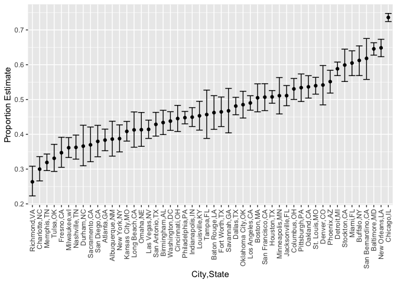

p8105\_hw5\_pm3148
================
Pooja Mukund
11/16/2021

``` r
#Load Libaries
library(tidyverse)
```

    ## ── Attaching packages ─────────────────────────────────────── tidyverse 1.3.1 ──

    ## ✓ ggplot2 3.3.5     ✓ purrr   0.3.4
    ## ✓ tibble  3.1.5     ✓ dplyr   1.0.7
    ## ✓ tidyr   1.1.3     ✓ stringr 1.4.0
    ## ✓ readr   2.0.1     ✓ forcats 0.5.1

    ## ── Conflicts ────────────────────────────────────────── tidyverse_conflicts() ──
    ## x dplyr::filter() masks stats::filter()
    ## x dplyr::lag()    masks stats::lag()

``` r
library(viridis)
```

    ## Loading required package: viridisLite

``` r
library(tools)
```

# Problem 1

``` r
#Load Data
homicide<- read_csv("data/homicide-data.csv", na = c("", "Unknown"))
```

    ## Rows: 52179 Columns: 12

    ## ── Column specification ────────────────────────────────────────────────────────
    ## Delimiter: ","
    ## chr (8): uid, victim_last, victim_first, victim_race, victim_sex, city, stat...
    ## dbl (4): reported_date, victim_age, lat, lon

    ## 
    ## ℹ Use `spec()` to retrieve the full column specification for this data.
    ## ℹ Specify the column types or set `show_col_types = FALSE` to quiet this message.

``` r
homicide_cln<-homicide%>%
  mutate(city_state = str_c(city, ",", state),
         resolution = case_when(disposition=="Closed without arrest" ~ "unsolved", 
                                disposition=="Open/No arrest" ~ "unsolved", 
                                disposition=="Closed by arrest" ~ "solved"))%>%
  relocate(city_state)%>%
  filter(city_state !="Tulsa,AL")
```

``` r
baltimore_df<- homicide_cln%>%
 filter(city_state=="Baltimore,MD")

baltimore_summary<- baltimore_df%>%
  summarize(
    unsolved = sum(resolution=="unsolved"),
    n=n()
  )

baltimore_test<-prop.test(
          x = baltimore_summary%>%pull(unsolved), 
          n = baltimore_summary%>%pull(n)
          )

baltimore_test%>%
  broom::tidy()
```

    ## # A tibble: 1 × 8
    ##   estimate statistic  p.value parameter conf.low conf.high method    alternative
    ##      <dbl>     <dbl>    <dbl>     <int>    <dbl>     <dbl> <chr>     <chr>      
    ## 1    0.646      239. 6.46e-54         1    0.628     0.663 1-sample… two.sided

# Create prop test function

``` r
prop_test_function<-function(city_df){
  city_summary = 
    city_df%>%
    summarize(
      unsolved = sum(resolution=="unsolved"),
    n=n()
  )
  
  city_test = 
    prop.test(x = city_summary%>%pull(unsolved), 
          n = city_summary%>%pull(n))
  return(city_test)
}

prop_test_function(baltimore_df)
```

    ## 
    ##  1-sample proportions test with continuity correction
    ## 
    ## data:  city_summary %>% pull(unsolved) out of city_summary %>% pull(n), null probability 0.5
    ## X-squared = 239.01, df = 1, p-value < 2.2e-16
    ## alternative hypothesis: true p is not equal to 0.5
    ## 95 percent confidence interval:
    ##  0.6275625 0.6631599
    ## sample estimates:
    ##         p 
    ## 0.6455607

\#Iterate over entire dataset

``` r
nested_df<-
  homicide_cln%>%
  nest(data = uid:resolution)%>%
  mutate(test_results = map(data, prop_test_function),
         tidy_results = map(test_results, broom::tidy))

nested_df%>%
  filter(city_state=="Baltimore,MD")%>%
  pull(tidy_results)
```

    ## [[1]]
    ## # A tibble: 1 × 8
    ##   estimate statistic  p.value parameter conf.low conf.high method    alternative
    ##      <dbl>     <dbl>    <dbl>     <int>    <dbl>     <dbl> <chr>     <chr>      
    ## 1    0.646      239. 6.46e-54         1    0.628     0.663 1-sample… two.sided

``` r
results_df<-
  homicide_cln%>%
  nest(data = uid:resolution)%>%
  mutate(test_results = map(data, prop_test_function),
         tidy_results = map(test_results, broom::tidy))%>%
  select(city_state, tidy_results)%>%
  unnest(tidy_results)%>%
  select(city_state, estimate, starts_with("conf"))
```

Make plot with Geom Error Bar

``` r
results_df%>%
  mutate(city_state = fct_reorder(city_state, estimate))%>%
  ggplot(aes(x = city_state, y=estimate)) + 
  geom_point()+
  geom_errorbar(aes(ymin = conf.low, ymax = conf.high))+
  theme(axis.text.x = element_text(angle = 90, vjust=0.5, hjust=1))+xlab("City,State")+ylab("Proportion Estimate")
```

<!-- --> \#
Problem 2

``` r
file_path = "data/study"
files<-list.files(path = file_path, full.names = FALSE)

study_cln<-
  tibble(filename = files)%>%
  mutate(file_contents = map(filename, ~ read_csv(file.path("data/study", .))),
         arm = str_extract(filename, "con|exp"),
         subject_id =file_path_sans_ext(filename))%>%
  unnest(file_contents)%>%
  select(-filename)%>%
  relocate(subject_id, arm)%>%
  pivot_longer(
    week_1:week_8, 
    names_to = "week",
    values_to = "observation_score"
  )%>%
  mutate(week = factor(week, levels=c("week_1", "week_2","week_3","week_4","week_5","week_6","week_7","week_8")))

study_cln
```

    ## # A tibble: 160 × 4
    ##    subject_id arm   week   observation_score
    ##    <chr>      <chr> <fct>              <dbl>
    ##  1 con_01     con   week_1              0.2 
    ##  2 con_01     con   week_2             -1.31
    ##  3 con_01     con   week_3              0.66
    ##  4 con_01     con   week_4              1.96
    ##  5 con_01     con   week_5              0.23
    ##  6 con_01     con   week_6              1.09
    ##  7 con_01     con   week_7              0.05
    ##  8 con_01     con   week_8              1.94
    ##  9 con_02     con   week_1              1.13
    ## 10 con_02     con   week_2             -0.88
    ## # … with 150 more rows

Spagetti Plot

``` r
study_cln%>%
  ggplot(aes(x = week, y = observation_score, group = subject_id, color = subject_id))+geom_line()+facet_wrap(~ arm)+
  theme(axis.text.x = element_text(angle = 45, vjust=0.5, hjust=1))+
  scale_color_discrete(name = "Subject ID")+
  xlab("Week")+
  ylab("Obervation Score")
```

<!-- -->

# Problem 3

``` r
set.seed(10)

iris_with_missing = iris %>% 
  map_df(~replace(.x, sample(1:150, 20), NA)) %>%
  mutate(Species = as.character(Species))
```

Write function to fill in missing values

``` r
fill_in_missing = function(vectorvar){
  if(is.numeric(vectorvar)){
    vectorvar = replace_na(vectorvar, mean(vectorvar, na.rm=TRUE))
  }
  if(is.character(vectorvar)){
    vectorvar = replace_na(vectorvar, "virginica")
  }
  return(vectorvar)
}

#Case Numeric - Test
fill_in_missing(iris_with_missing$Petal.Width)
```

    ##   [1] 0.200000 0.200000 0.200000 1.192308 0.200000 0.400000 0.300000 0.200000
    ##   [9] 0.200000 0.100000 0.200000 0.200000 0.100000 0.100000 0.200000 0.400000
    ##  [17] 0.400000 1.192308 0.300000 1.192308 0.200000 0.400000 0.200000 0.500000
    ##  [25] 0.200000 0.200000 0.400000 0.200000 0.200000 0.200000 0.200000 0.400000
    ##  [33] 0.100000 0.200000 0.200000 0.200000 0.200000 0.100000 1.192308 0.200000
    ##  [41] 0.300000 1.192308 0.200000 0.600000 0.400000 0.300000 0.200000 0.200000
    ##  [49] 0.200000 0.200000 1.400000 1.500000 1.500000 1.300000 1.500000 1.300000
    ##  [57] 1.600000 1.000000 1.300000 1.400000 1.000000 1.500000 1.192308 1.400000
    ##  [65] 1.300000 1.400000 1.500000 1.000000 1.500000 1.100000 1.800000 1.300000
    ##  [73] 1.500000 1.200000 1.300000 1.400000 1.400000 1.192308 1.192308 1.000000
    ##  [81] 1.100000 1.000000 1.200000 1.600000 1.500000 1.600000 1.192308 1.300000
    ##  [89] 1.192308 1.192308 1.200000 1.192308 1.192308 1.192308 1.300000 1.200000
    ##  [97] 1.300000 1.300000 1.192308 1.300000 2.500000 1.900000 2.100000 1.800000
    ## [105] 2.200000 2.100000 1.700000 1.800000 1.800000 2.500000 2.000000 1.900000
    ## [113] 2.100000 2.000000 2.400000 2.300000 1.800000 1.192308 2.300000 1.500000
    ## [121] 1.192308 2.000000 2.000000 1.800000 2.100000 1.800000 1.800000 1.800000
    ## [129] 2.100000 1.600000 1.192308 2.000000 2.200000 1.500000 1.400000 2.300000
    ## [137] 1.192308 1.192308 1.800000 2.100000 2.400000 2.300000 1.900000 2.300000
    ## [145] 2.500000 2.300000 1.900000 2.000000 2.300000 1.800000

``` r
#Case Character - Test
fill_in_missing(iris_with_missing$Species)
```

    ##   [1] "setosa"     "setosa"     "setosa"     "setosa"     "setosa"    
    ##   [6] "setosa"     "setosa"     "setosa"     "setosa"     "setosa"    
    ##  [11] "setosa"     "setosa"     "setosa"     "setosa"     "setosa"    
    ##  [16] "setosa"     "setosa"     "setosa"     "setosa"     "setosa"    
    ##  [21] "setosa"     "virginica"  "setosa"     "setosa"     "virginica" 
    ##  [26] "setosa"     "virginica"  "setosa"     "setosa"     "setosa"    
    ##  [31] "setosa"     "setosa"     "setosa"     "setosa"     "setosa"    
    ##  [36] "setosa"     "setosa"     "setosa"     "setosa"     "setosa"    
    ##  [41] "setosa"     "virginica"  "setosa"     "setosa"     "setosa"    
    ##  [46] "virginica"  "setosa"     "setosa"     "setosa"     "setosa"    
    ##  [51] "virginica"  "versicolor" "versicolor" "versicolor" "versicolor"
    ##  [56] "versicolor" "virginica"  "versicolor" "virginica"  "versicolor"
    ##  [61] "versicolor" "versicolor" "versicolor" "versicolor" "versicolor"
    ##  [66] "versicolor" "versicolor" "versicolor" "versicolor" "versicolor"
    ##  [71] "versicolor" "virginica"  "versicolor" "versicolor" "versicolor"
    ##  [76] "versicolor" "versicolor" "versicolor" "versicolor" "virginica" 
    ##  [81] "versicolor" "versicolor" "versicolor" "versicolor" "versicolor"
    ##  [86] "versicolor" "versicolor" "versicolor" "versicolor" "versicolor"
    ##  [91] "versicolor" "versicolor" "versicolor" "virginica"  "versicolor"
    ##  [96] "versicolor" "versicolor" "versicolor" "versicolor" "virginica" 
    ## [101] "virginica"  "virginica"  "virginica"  "virginica"  "virginica" 
    ## [106] "virginica"  "virginica"  "virginica"  "virginica"  "virginica" 
    ## [111] "virginica"  "virginica"  "virginica"  "virginica"  "virginica" 
    ## [116] "virginica"  "virginica"  "virginica"  "virginica"  "virginica" 
    ## [121] "virginica"  "virginica"  "virginica"  "virginica"  "virginica" 
    ## [126] "virginica"  "virginica"  "virginica"  "virginica"  "virginica" 
    ## [131] "virginica"  "virginica"  "virginica"  "virginica"  "virginica" 
    ## [136] "virginica"  "virginica"  "virginica"  "virginica"  "virginica" 
    ## [141] "virginica"  "virginica"  "virginica"  "virginica"  "virginica" 
    ## [146] "virginica"  "virginica"  "virginica"  "virginica"  "virginica"

Apply to entire dataset

``` r
iris_with_missing%>%
  map_df(~fill_in_missing(.x))%>%
summarise_all(funs(sum(is.na(.))))
```

    ## Warning: `funs()` was deprecated in dplyr 0.8.0.
    ## Please use a list of either functions or lambdas: 
    ## 
    ##   # Simple named list: 
    ##   list(mean = mean, median = median)
    ## 
    ##   # Auto named with `tibble::lst()`: 
    ##   tibble::lst(mean, median)
    ## 
    ##   # Using lambdas
    ##   list(~ mean(., trim = .2), ~ median(., na.rm = TRUE))
    ## This warning is displayed once every 8 hours.
    ## Call `lifecycle::last_lifecycle_warnings()` to see where this warning was generated.

    ## # A tibble: 1 × 5
    ##   Sepal.Length Sepal.Width Petal.Length Petal.Width Species
    ##          <int>       <int>        <int>       <int>   <int>
    ## 1            0           0            0           0       0

``` r
#No more NAs!

iris_with_missing%>%
  map_df(~fill_in_missing(.x))
```

    ## # A tibble: 150 × 5
    ##    Sepal.Length Sepal.Width Petal.Length Petal.Width Species
    ##           <dbl>       <dbl>        <dbl>       <dbl> <chr>  
    ##  1         5.1          3.5         1.4         0.2  setosa 
    ##  2         4.9          3           1.4         0.2  setosa 
    ##  3         4.7          3.2         1.3         0.2  setosa 
    ##  4         4.6          3.1         1.5         1.19 setosa 
    ##  5         5            3.6         1.4         0.2  setosa 
    ##  6         5.4          3.9         1.7         0.4  setosa 
    ##  7         5.82         3.4         1.4         0.3  setosa 
    ##  8         5            3.4         1.5         0.2  setosa 
    ##  9         4.4          2.9         1.4         0.2  setosa 
    ## 10         4.9          3.1         3.77        0.1  setosa 
    ## # … with 140 more rows
